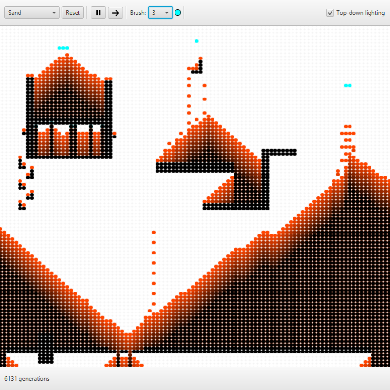

# Automaton

*The millionth billionth cellular automata project on Github!*

Automaton is a simple program for processing & visualizing rules of cellular automata (CA) in a 100x100 grid. The grid represents a CA's state at a particular instance of time. Each cell within the grid follows an update rule to determine what happens in the next state, usually depending on the state of its neighboring cells. For instance, if a "dead" cell is neighbored by two "alive" cells, the dead cell may become alive as though it were the offspring of the two alive cells. In some cases, this leads to very interesting behaviours.

  

## Rule Sets
Each CA is defined as a **Rule Set**, which defines both the colours used by different cell types, as well as the rules used for updating the grid at each time step. As of now, the program has the following rule sets:
- John Conway's "Game of Life" (https://en.wikipedia.org/wiki/Conway%27s_Game_of_Life)
- Brian Silverman's "Brain" (https://en.wikipedia.org/wiki/Brian%27s_Brain)
- Sand simulation

## Future work
Of course, an application such as this one could be improved in various domains:
- Larger grids (perhaps even "infinitely many" grids through chunks)
- Zooming in and out (for observing the behaviour of certain configurations & precise grid editing)
- User-friendly way to define rule sets (for example through a TXT file with the rules encoded in a precise way)
- Storing grid histories (undos and redos)
- Analytical tools (for example, plotting the number of alive cells at any given time instance of Conway's Game of Life)

Alas, since this project was only developed as an exercise in JavaFX, these features can wait :)
